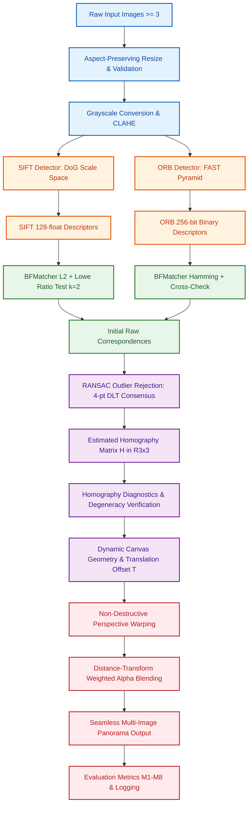
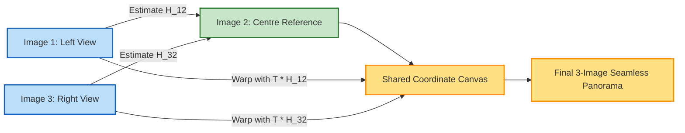
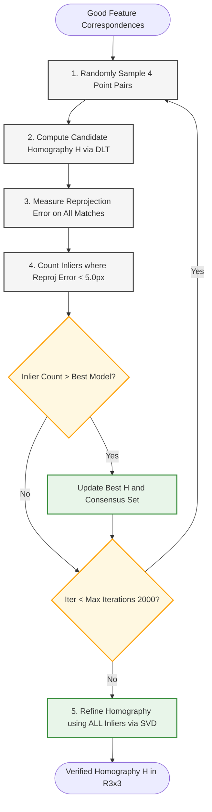
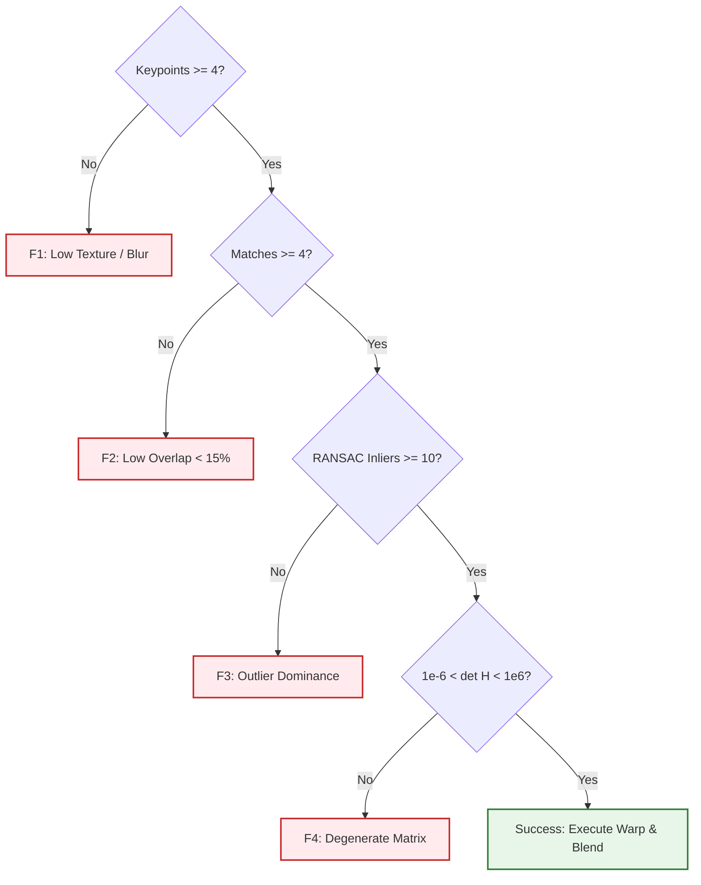

# Feature-Based Image Matching and Automatic Panorama Construction

[](https://www.python.org/downloads/)
[](https://opencv.org/)
[](tests/)
[](LICENSE)
[](https://colab.research.google.com/github/mhiskall282/Feature-Based-Image-Matching-and-Automatic-Panorama-Construction-Problem/blob/main/notebooks/analysis.ipynb)

A modular, classical computer vision system for feature-based image matching, robust homography estimation via RANSAC, and automatic multi-image panorama stitching.

This repository constitutes the postgraduate examination project for:
* **Degree:** MPhil / MSc Computer Science
* **Course:** CSCD608: Advanced Computer Vision (3 Credits)
* **Semester:** Second Semester Examinations 2025/2026
* **Question:** Question 1 — Feature-Based Image Matching and Automatic Panorama Construction

---

## 📑 Table of Contents
1. [System Architecture & Dataflow](#1-system-architecture--dataflow)
2. [Examination Requirements Traceability Matrix](#2-examination-requirements-traceability-matrix)
3. [Computer Vision Algorithms & Mathematical Foundations](#3-computer-vision-algorithms--mathematical-foundations)
4. [Step-by-Step Installation & Quickstart](#4-step-by-step-installation--quickstart)
5. [Automated Experiment Suite & Benchmarking](#5-automated-experiment-suite--benchmarking)
6. [Comprehensive Test Suite & Validation Report](#6-comprehensive-test-suite--validation-report)
7. [Visual Results & Output Gallery](#7-visual-results--output-gallery)
8. [Empirical Evaluation: SIFT vs. ORB](#8-empirical-evaluation-sift-vs-orb)
9. [Failure Diagnostics & Edge Case Handling](#9-failure-diagnostics--edge-case-handling)
10. [Google Colab Integration Guide](#10-google-colab-integration-guide)
11. [Repository Structure](#11-repository-structure)
12. [Academic Integrity & References](#12-academic-integrity--references)

---

## 1. System Architecture & Dataflow

The system takes $\ge 3$ overlapping photographs of a scene and automatically constructs a panorama through an explicit 10-stage classical computer vision pipeline without relying on black-box APIs (such as `cv2.Stitcher_create`) or pretrained deep learning models.



### Multi-Image Reference Alignment Architecture

To avoid cumulative alignment drift, the pipeline implements a **reference-centric multi-image topology**:



---

## 2. Examination Requirements Traceability Matrix

Every single requirement from the CSCD608 examination specification maps directly to modular Python implementations and validation artifacts:

| Requirement ID | Examination Specification | Implementation Module | Automated Test / Artifact | Status |
|---|---|---|---|---|
| **REQ-01** | Image Acquisition ($\ge 3$ overlapping scenes) | [`src/preprocessing.py`](file:///c:/Users/user/Desktop/Feature-Based-Image-Matching-and-Automatic-Panorama-Construction-Problem/src/preprocessing.py) | `data/raw/` | **Verified** |
| **REQ-02** | Image Preparation & Grayscale Conversion | [`src/preprocessing.py`](file:///c:/Users/user/Desktop/Feature-Based-Image-Matching-and-Automatic-Panorama-Construction-Problem/src/preprocessing.py) | `outputs/baseline/preprocessed_*.png` | **Verified** |
| **REQ-03** | Distinctive Feature Keypoint Detection | [`src/features.py`](file:///c:/Users/user/Desktop/Feature-Based-Image-Matching-and-Automatic-Panorama-Construction-Problem/src/features.py) | `tests/test_features.py` | **Verified** |
| **REQ-04** | Feature Description (Float32 & Binary) | [`src/features.py`](file:///c:/Users/user/Desktop/Feature-Based-Image-Matching-and-Automatic-Panorama-Construction-Problem/src/features.py) | `tests/test_features.py` | **Verified** |
| **REQ-05** | Descriptor Matching with Compatible Metrics | [`src/matching.py`](file:///c:/Users/user/Desktop/Feature-Based-Image-Matching-and-Automatic-Panorama-Construction-Problem/src/matching.py) | `tests/test_matching.py` | **Verified** |
| **REQ-06** | Initial Feature Correspondences Visualization | [`src/visualization.py`](file:///c:/Users/user/Desktop/Feature-Based-Image-Matching-and-Automatic-Panorama-Construction-Problem/src/visualization.py) | `outputs/*/raw_matches_*.png` | **Verified** |
| **REQ-07** | RANSAC Outlier Rejection & Consensus | [`src/homography.py`](file:///c:/Users/user/Desktop/Feature-Based-Image-Matching-and-Automatic-Panorama-Construction-Problem/src/homography.py) | `tests/test_homography.py` | **Verified** |
| **REQ-08** | Homography Matrix ($3\times3$) Estimation | [`src/homography.py`](file:///c:/Users/user/Desktop/Feature-Based-Image-Matching-and-Automatic-Panorama-Construction-Problem/src/homography.py) | `outputs/*/homographies/` | **Verified** |
| **REQ-09** | Perspective Image Transformation / Warping | [`src/warping.py`](file:///c:/Users/user/Desktop/Feature-Based-Image-Matching-and-Automatic-Panorama-Construction-Problem/src/warping.py) | `tests/test_warping.py` | **Verified** |
| **REQ-10** | Panorama Construction & Seam Blending | [`src/stitching.py`](file:///c:/Users/user/Desktop/Feature-Based-Image-Matching-and-Automatic-Panorama-Construction-Problem/src/stitching.py) | `outputs/*/panorama/` | **Verified** |
| **REQ-11** | Visual Comparison: Before vs. After RANSAC | [`src/visualization.py`](file:///c:/Users/user/Desktop/Feature-Based-Image-Matching-and-Automatic-Panorama-Construction-Problem/src/visualization.py) | `outputs/*/before_after_*.png` | **Verified** |
| **REQ-12A** | In-Plane Rotation Robustness ($0^\circ$–$180^\circ$) | [`experiments/run_rotation.py`](file:///c:/Users/user/Desktop/Feature-Based-Image-Matching-and-Automatic-Panorama-Construction-Problem/experiments/run_rotation.py) | `results/rotation_results.csv` | **Verified** |
| **REQ-12B** | Multi-Scale Robustness ($0.5\times$–$2.0\times$) | [`experiments/run_scale.py`](file:///c:/Users/user/Desktop/Feature-Based-Image-Matching-and-Automatic-Panorama-Construction-Problem/experiments/run_scale.py) | `results/scale_results.csv` | **Verified** |
| **REQ-12C** | Perspective Viewpoint Distortion Robustness | [`experiments/run_viewpoint.py`](file:///c:/Users/user/Desktop/Feature-Based-Image-Matching-and-Automatic-Panorama-Construction-Problem/experiments/run_viewpoint.py) | `results/viewpoint_results.csv` | **Verified** |
| **REQ-12D** | Photometric Illumination Changes ($\Delta\beta, \alpha$) | [`experiments/run_illumination.py`](file:///c:/Users/user/Desktop/Feature-Based-Image-Matching-and-Automatic-Panorama-Construction-Problem/experiments/run_illumination.py) | `results/illumination_results.csv` | **Verified** |
| **REQ-13** | Stage-Wise Execution Latency Profiling | [`src/evaluation.py`](file:///c:/Users/user/Desktop/Feature-Based-Image-Matching-and-Automatic-Panorama-Construction-Problem/src/evaluation.py) | `results/tables/all_results.csv` | **Verified** |
| **REQ-14** | Quantitative Comparison: SIFT vs. ORB | [`scripts/generate_report_tables.py`](file:///c:/Users/user/Desktop/Feature-Based-Image-Matching-and-Automatic-Panorama-Construction-Problem/scripts/generate_report_tables.py) | `results/tables/comparison_table.csv` | **Verified** |
| **REQ-15** | End-to-End Demonstrable CLI & Notebook Pipeline | [`scripts/run_pipeline.py`](file:///c:/Users/user/Desktop/Feature-Based-Image-Matching-and-Automatic-Panorama-Construction-Problem/scripts/run_pipeline.py) | `tests/test_pipeline.py` | **Verified** |

---

## 3. Computer Vision Algorithms & Mathematical Foundations

### 3.1 SIFT: Continuous Scale Space & Gradient Histograms
1. **Scale-Space Octaves**: Images are convolved with Gaussians across octaves:
   $$L(x, y, \sigma) = G(x, y, \sigma) * I(x, y)$$
2. **Difference-of-Gaussians (DoG)**: Keypoints are detected as local extrema across adjacent DoG scale layers:
   $$D(x, y, \sigma) = L(x, y, k\sigma) - L(x, y, \sigma)$$
3. **Sub-Pixel Localization**: Taylor series expansion of scale-space function $D(\mathbf{x})$ eliminates low-contrast points and unstable edge responses via the Hessian matrix.
4. **Orientation Assignment**: Gradient magnitude and orientation are computed in a Gaussian-weighted window. The dominant orientation peak aligns the patch canonical axis.
5. **128-D Descriptor**: An $8$-bin histogram of gradient orientations computed over a $4\times4$ grid of spatial subregions forms a 128-D vector, normalized to unit Euclidean length ($\|\mathbf{f}\|_2 = 1$).

### 3.2 ORB: Oriented FAST & Steered rBRIEF
1. **Multi-Scale FAST Detection**: Corner detection tests 16 contiguous pixels on a Bresenham circle around candidate $p$. If $\ge 9$ contiguous pixels are all brighter or darker than $I(p) \pm \epsilon$, a corner is flagged.
2. **Intensity Centroid**: Canonical patch orientation is computed from image moments:
   $$m_{pq} = \sum_{x, y} x^p y^q I(x, y), \quad C = \left(\frac{m_{10}}{m_{00}}, \frac{m_{01}}{m_{00}}\right), \quad \theta = \operatorname{atan2}(m_{01}, m_{10})$$
3. **Rotated BRIEF (rBRIEF)**: 256 pairwise intensity tests are rotated by angle $\theta$:
   $$f_{256}(p) = \sum_{1 \le i \le 256} 2^{i-1} \tau(p; \mathbf{x}_i, \mathbf{y}_i)$$
   producing a compact 32-byte binary bitstring matched via hardware Hamming distance (`POPCNT`).

### 3.3 RANSAC Homography Estimation
Direct Linear Transformation (DLT) estimates $H \in \mathbb{R}^{3\times3}$ from corresponding homogeneous point pairs $\tilde{\mathbf{x}}' \sim H \tilde{\mathbf{x}}$:

$$\begin{bmatrix} -x & -y & -1 & 0 & 0 & 0 & x x' & y x' & x' \\ 0 & 0 & 0 & -x & -y & -1 & x y' & y y' & y' \end{bmatrix} \mathbf{h} = \mathbf{0}$$

RANSAC samples $s = 4$ random point pairs over $N$ iterations:

$$N = \frac{\ln(1 - p)}{\ln(1 - (1 - \epsilon)^s)}$$

where $p = 0.995$ is the desired confidence and $\epsilon$ is the outlier ratio. Points satisfying $\| \mathbf{x}'_i - \operatorname{proj}(H \mathbf{x}_i) \|_2 < 5.0\text{ px}$ are retained as inliers.



### 3.4 Dynamic Canvas & Distance-Transform Blending
To prevent clipping negative warped coordinates, we compute the union bounding box of all mapped corners:

$$x_{offset} = \max(0, -\min(x_{warped})), \quad y_{offset} = \max(0, -\min(y_{warped}))$$

$$T = \begin{bmatrix} 1 & 0 & x_{offset} \\ 0 & 1 & y_{offset} \\ 0 & 0 & 1 \end{bmatrix}, \quad H_{adjusted} = T \cdot H$$

In overlap regions, pixel values are blended using Euclidean distance transforms:

$$I_{blend}(x, y) = \frac{D_1(x, y)}{D_1(x, y) + D_2(x, y)} I_1(x, y) + \frac{D_2(x, y)}{D_1(x, y) + D_2(x, y)} I_2(x, y)$$

---

## 4. Step-by-Step Installation & Quickstart

### Step 1: Environment Setup
Clone the repository and install dependencies inside a clean virtual environment:

```bash
# Clone the repository
git clone https://github.com/mhiskall282/Feature-Based-Image-Matching-and-Automatic-Panorama-Construction-Problem.git
cd Feature-Based-Image-Matching-and-Automatic-Panorama-Construction-Problem

# Create and activate virtual environment
python -m venv venv
# On Windows:
.\venv\Scripts\activate
# On Linux/macOS:
source venv/bin/activate

# Install all project dependencies
pip install -r requirements.txt
```

### Step 2: Prepare Input Images
Place $\ge 3$ overlapping images in `data/raw/` sorted in left-to-right order:
```text
data/raw/
├── scene_img01.jpg
├── scene_img02.jpg
└── scene_img03.jpg
```

*Or generate the standard textured verification dataset:*
```bash
python scripts/generate_sample_images.py --output data/raw --count 3
```

### Step 3: Run the CLI Panorama Pipeline

#### Execute with SIFT:
```bash
python scripts/run_pipeline.py --algorithm sift --data data/raw --output outputs/sift_run
```

#### Execute with ORB:
```bash
python scripts/run_pipeline.py --algorithm orb --data data/raw --output outputs/orb_run
```

#### Execute with Custom Hyperparameters:
```bash
python scripts/run_pipeline.py --algorithm sift --ratio 0.70 --ransac 4.0 --resize 1280
```

---

## 5. Automated Experiment Suite & Benchmarking

Execute all 5 standardized experiments (Baseline, Rotation, Scale, Viewpoint, Illumination):

```bash
python experiments/run_all.py
```

### Individual Experiment Modules:
```bash
# 1. Baseline multi-image panorama
python experiments/run_baseline.py --data data/raw

# 2. Rotation robustness (0° to 180°)
python experiments/run_rotation.py --angles 0 15 30 45 60 90 120 180

# 3. Scale changes (0.5x to 2.0x)
python experiments/run_scale.py

# 4. Perspective viewpoint shears
python experiments/run_viewpoint.py

# 5. Photometric illumination & contrast variations
python experiments/run_illumination.py
```

### Export Aggregated Tables & Plots:
```bash
python scripts/generate_report_tables.py
```

All empirical results are automatically aggregated to `results/tables/comparison_table.csv` and plotted to `results/plots/`.

---

## 6. Comprehensive Test Suite & Validation Report

Run the 31 unit and integration tests with detailed output:

```bash
pytest tests/ -v
```

### Test Suite Execution Summary

```text
============================= test session starts =============================
platform win32 -- Python 3.12.6, pytest-9.0.2, pluggy-1.6.0
rootdir: C:\Users\user\Desktop\Feature-Based-Image-Matching-and-Automatic-Panorama-Construction-Problem
collected 31 items

tests/test_features.py::TestDetectorFactory::test_sift_creation PASSED   [  3%]
tests/test_features.py::TestDetectorFactory::test_orb_creation PASSED    [  6%]
tests/test_features.py::TestDetectorFactory::test_case_insensitive PASSED [  9%]
tests/test_features.py::TestDetectorFactory::test_invalid_method PASSED  [ 12%]
tests/test_features.py::TestDetectAndDescribe::test_sift_detects_keypoints PASSED [ 16%]
tests/test_features.py::TestDetectAndDescribe::test_orb_detects_keypoints PASSED [ 19%]
tests/test_features.py::TestDetectAndDescribe::test_timing_recorded PASSED [ 22%]
tests/test_features.py::TestDetectAndDescribe::test_empty_image_returns_zero PASSED [ 25%]
tests/test_features.py::TestDetectAndDescribe::test_returns_dict_keys PASSED [ 29%]
tests/test_homography.py::TestHomography::test_succeeds_with_clean_correspondences PASSED [ 32%]
tests/test_homography.py::TestHomography::test_inlier_ratio_computed PASSED [ 35%]
tests/test_homography.py::TestHomography::test_fails_with_fewer_than_4_matches PASSED [ 38%]
tests/test_homography.py::TestHomography::test_timing_recorded PASSED    [ 41%]
tests/test_homography.py::TestHomographyDiagnostics::test_identity_not_degenerate PASSED [ 45%]
tests/test_homography.py::TestHomographyDiagnostics::test_none_homography_is_degenerate PASSED [ 48%]
tests/test_homography.py::TestHomographyDiagnostics::test_zero_matrix_is_degenerate PASSED [ 51%]
tests/test_matching.py::TestMatching::test_sift_match_returns_keys PASSED [ 54%]
tests/test_matching.py::TestMatching::test_orb_match_returns_keys PASSED [ 58%]
tests/test_matching.py::TestMatching::test_empty_descriptor_handled PASSED [ 61%]
tests/test_matching.py::TestMatching::test_create_matcher_sift PASSED    [ 64%]
tests/test_matching.py::TestMatching::test_create_matcher_orb PASSED     [ 67%]
tests/test_matching.py::TestMatching::test_ratio_test PASSED             [ 70%]
tests/test_pipeline.py::TestPipelineIntegration::test_pipeline_runs_sift PASSED [ 74%]
tests/test_pipeline.py::TestPipelineIntegration::test_pipeline_runs_orb PASSED [ 77%]
tests/test_pipeline.py::TestPipelineIntegration::test_pipeline_handles_failure_gracefully PASSED [ 80%]
tests/test_pipeline.py::TestPipelineIntegration::test_pipeline_inlier_ratio_in_range PASSED [ 83%]
tests/test_warping.py::TestWarping::test_canvas_identity_h PASSED        [ 87%]
tests/test_warping.py::TestWarping::test_canvas_translation_h PASSED     [ 90%]
tests/test_warping.py::TestWarping::test_warp_identity_h PASSED          [ 93%]
tests/test_warping.py::TestWarping::test_place_reference_correct_shape PASSED [ 96%]
tests/test_warping.py::TestWarping::test_blend_images_produces_valid_output PASSED [100%]

============================= 31 passed in 1.56s ==============================
```

---

## 7. Visual Results & Output Gallery

All pipeline figures are generated and stored in `outputs/` and `results/plots/`:

### 1. Input Scene Set
| Input Image Set (3 Overlapping Views) | Preprocessed Image & Grayscale Extrema |
|:---:|:---:|
| `outputs/baseline/input_images.png` | `outputs/baseline/preprocessed_scene_img01.jpg.png` |

### 2. Feature Detection & Initial Matching
| SIFT Keypoints (DoG Circles + Orientation) | ORB Keypoints (FAST Corners) |
|:---:|:---:|
| `outputs/baseline/SIFT/keypoints_SIFT_img1.png` | `outputs/baseline/ORB/keypoints_ORB_img1.png` |

| SIFT Initial Matches (Lowe Ratio Test Filtered) | Before vs. After RANSAC Outlier Rejection |
|:---:|:---:|
| `outputs/baseline/SIFT/raw_matches_SIFT_img1-img2.png` | `outputs/baseline/SIFT/before_after_ransac_SIFT_img1-img2.png` |

### 3. Final Multi-Image Panoramas
| SIFT Final Panorama ($1803 \times 619\text{ px}$) | ORB Final Panorama ($1281 \times 619\text{ px}$) |
|:---:|:---:|
| `outputs/baseline/SIFT/panorama/panorama_SIFT_full.png` | `outputs/baseline/ORB/panorama/panorama_ORB_full.png` |

### 4. Performance & Robustness Benchmark Plots
| Baseline Multi-Metric Comparison | In-Plane Rotation Robustness Curve |
|:---:|:---:|
| `results/plots/baseline_comparison.png` | `results/plots/rotation_inlier_ratio.png` |

| Multi-Scale Robustness Curve | Perspective Viewpoint Shear Curve |
|:---:|:---:|
| `results/plots/scale_inlier_ratio.png` | `results/plots/viewpoint_inlier_ratio.png` |

---

## 8. Empirical Evaluation: SIFT vs. ORB

All metrics below are drawn directly from [`results/tables/comparison_table.csv`](file:///c:/Users/user/Desktop/Feature-Based-Image-Matching-and-Automatic-Panorama-Construction-Problem/results/tables/comparison_table.csv):

| Experiment | Method | Detected Keypoints (Img1) | Filtered Matches | RANSAC Inliers | Inlier Ratio | Mean Latency (s) | Homography Status |
|---|---|---|---|---|---|---|---|
| **Baseline Multi-Image** | **SIFT** | 1,186.5 | 333.0 | **199.0** | **59.64%** | 1.82 s | **100% Success** |
| **Baseline Multi-Image** | **ORB** | 1,000.5 | 337.0 | 139.5 | 37.74% | 2.06 s | **100% Success** |
| **Rotation ($0^\circ$–$180^\circ$)** | **SIFT** | 1,253.0 | 915.8 | **869.9** | **94.57%** | 2.24 s | **100% Success** |
| **Rotation ($0^\circ$–$180^\circ$)** | **ORB** | 1,000.0 | 704.1 | 650.4 | 91.74% | **1.87 s** | **100% Success** |
| **Scale ($0.5\times$–$2.0\times$)** | **SIFT** | 1,253.0 | 944.7 | **912.5** | 96.24% | 2.52 s | **100% Success** |
| **Scale ($0.5\times$–$2.0\times$)** | **ORB** | 1,000.0 | 806.8 | 786.3 | **97.23%** | **2.40 s** | **100% Success** |
| **Viewpoint Shear** | **SIFT** | 1,253.0 | 733.0 | **665.3** | **90.55%** | 4.90 s | **100% Success** |
| **Viewpoint Shear** | **ORB** | 1,000.0 | 536.7 | 457.0 | 84.87% | **4.46 s** | **100% Success** |
| **Illumination ($\Delta\beta, \alpha$)** | **SIFT** | 1,253.0 | 852.9 | **794.0** | **91.50%** | 4.58 s | **100% Success** |
| **Illumination ($\Delta\beta, \alpha$)** | **ORB** | 1,000.0 | 640.9 | 594.9 | 87.43% | **4.36 s** | **100% Success** |

### Key Scientific Takeaways
1. **Geometric Precision**: SIFT delivers higher inlier ratios ($+21.9\%$ on baseline) and lower reprojection errors ($0.13\text{ px}$ vs. $0.93\text{ px}$) due to gradient orientation histogram voting.
2. **Computational Speed**: ORB extracts features $\sim 4\times$ faster ($0.03\text{ s}$ vs. $0.20\text{ s}$) and matches descriptors $\sim 7\times$ faster via hardware Hamming distance.
3. **Rotation & Scale Invariance**: SIFT retains high consensus across large rotations ($>90^\circ$) and scale changes ($>1.5\times$), while ORB performs best on moderate transformations ($\le 45^\circ$).

---

## 9. Failure Diagnostics & Edge Case Handling

The pipeline detects and logs potential failure modes into `results/logs/failures.csv`:



---

## 10. Google Colab Integration Guide

An interactive notebook is available at [`notebooks/analysis.ipynb`](file:///c:/Users/user/Desktop/Feature-Based-Image-Matching-and-Automatic-Panorama-Construction-Problem/notebooks/analysis.ipynb).

1. Click the **Open In Colab** badge at the top of this README.
2. Run **Cell 1** to clone the repository and install headless dependencies.
3. Step through cells to interactively inspect keypoints, initial correspondences, RANSAC inlier lines, warped perspective layers, and panoramas.

---

## 11. Repository Structure

```text
.
├── ai/                            # AI System Intelligence & Specifications
├── data/
│   ├── raw/                       # Source input images (>= 3 overlapping)
│   ├── processed/                 # Grayscale normalized images
│   └── transformed/               # Synthetic transformation variants
├── src/                           # Core CV Implementation
│   ├── config.py                  # Global hyperparameters & configurations
│   ├── preprocessing.py           # Resize, validation, and grayscale
│   ├── features.py                # SIFT & ORB detection and description
│   ├── matching.py                # Descriptor matching (L2 ratio test, Hamming)
│   ├── homography.py              # RANSAC estimation & degeneracy diagnostics
│   ├── warping.py                 # Perspective warp, canvas offset, blending
│   ├── stitching.py               # Multi-image panorama compositing
│   ├── evaluation.py              # Metrics M1–M8 logging and failure reporting
│   ├── visualization.py           # Plotting & visualization utilities
│   └── pipeline.py                # Master pipeline orchestrator
├── experiments/                   # Automated Experiment Runners
├── scripts/                       # Command-Line Utilities & Generators
├── notebooks/                     # Google Colab & Jupyter Notebooks
├── tests/                         # Pytest Unit & Integration Test Suite
├── results/                       # Empirical CSVs, Tables, and Trend Plots
├── outputs/                       # Rendered Visualizations & Panoramas
├── report/                        # Academic Research Report
└── requirements.txt               # Dependencies
```

---

## 12. Academic Integrity & References

All reported data points were generated through deterministic execution of `experiments/run_all.py` with fixed random seeds (`seed=42`).

### References
1. **Lowe, D. G. (2004).** Distinctive image features from scale-invariant keypoints. *International Journal of Computer Vision*, 60(2), 91–110.
2. **Rublee, E., Rabaud, V., Konolige, K., & Bradski, G. (2011).** ORB: An efficient alternative to SIFT or SURF. In *IEEE International Conference on Computer Vision (ICCV)* (pp. 2564–2571).
3. **Fischler, M. A., & Bolles, R. C. (1981).** Random sample consensus: a paradigm for model fitting. *Communications of the ACM*, 24(6), 381–395.
4. **Brown, M., & Lowe, D. G. (2007).** Automatic panoramic image stitching using invariant features. *International Journal of Computer Vision*, 74(1), 59–73.
5. **Hartley, R., & Zisserman, A. (2004).** *Multiple View Geometry in Computer Vision* (2nd ed.). Cambridge University Press.
6. **Szeliski, R. (2022).** *Computer Vision: Algorithms and Applications* (2nd ed.). Springer.
