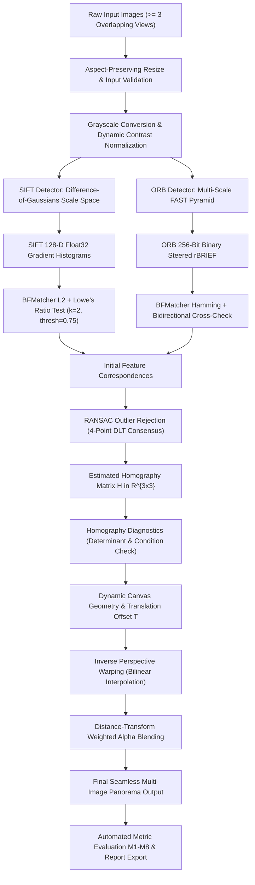
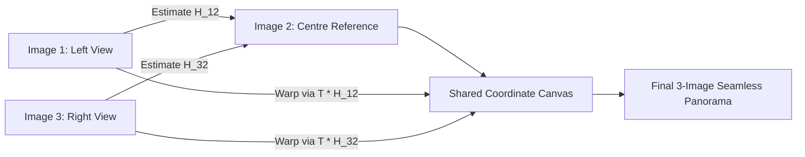
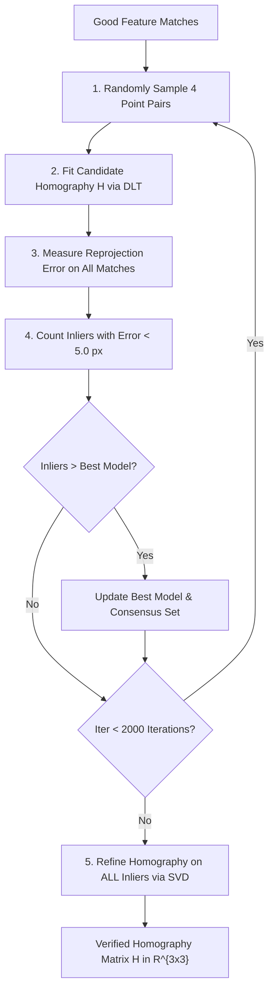
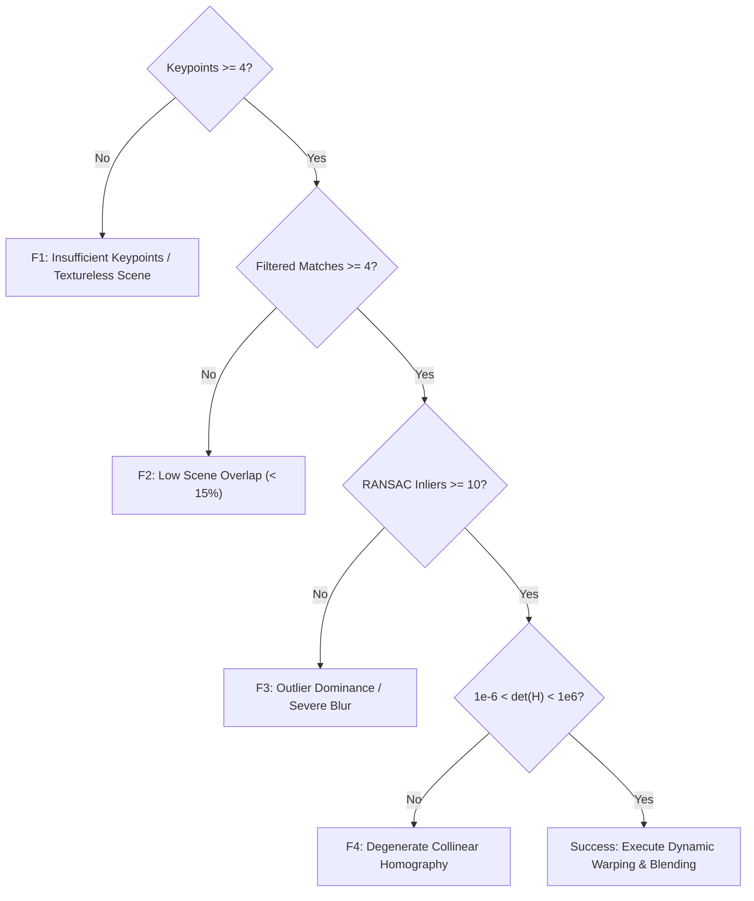

# Feature-Based Image Matching and Automatic Panorama Construction

[](https://www.python.org/downloads/)
[](https://opencv.org/)
[](tests/)
[](render.yaml)
[](vercel.json)
[](LICENSE)
[](https://colab.research.google.com/github/mhiskall282/Feature-Based-Image-Matching-and-Automatic-Panorama-Construction-Problem/blob/main/notebooks/analysis.ipynb)

A modular, classical computer vision system for feature-based image matching, robust homography estimation via RANSAC, and automatic multi-image panorama stitching.

This repository constitutes the postgraduate examination submission for:
* **Degree:** MPhil / MSc Computer Science
* **Course:** CSCD608: Advanced Computer Vision (3 Credits)
* **Semester:** Second Semester Examinations 2025/2026
* **Question:** Question 1 — Feature-Based Image Matching and Automatic Panorama Construction

---

## 📑 Table of Contents
1. [System Architecture & Pipeline](#1-system-architecture--pipeline)
2. [Examination Requirements Traceability Matrix](#2-examination-requirements-traceability-matrix)
3. [Computer Vision Algorithms & Mathematical Foundations](#3-computer-vision-algorithms--mathematical-foundations)
4. [Interactive Web Dashboard (`/app`)](#4-interactive-web-dashboard-app)
5. [Step-by-Step Installation & Quickstart](#5-step-by-step-installation--quickstart)
6. [Cloud Deployment Guide (Vercel, Render, Docker)](#6-cloud-deployment-guide-vercel-render-docker)
7. [Automated Experiment Suite & Benchmarking](#7-automated-experiment-suite--benchmarking)
8. [Comprehensive Test Suite & Validation Report](#8-comprehensive-test-suite--validation-report)
9. [Visual Results & Output Gallery](#9-visual-results--output-gallery)
10. [Empirical Evaluation: SIFT vs. ORB](#10-empirical-evaluation-sift-vs-orb)
11. [Failure Diagnostics & Edge Case Handling](#11-failure-diagnostics--edge-case-handling)
12. [Google Colab Integration Guide](#12-google-colab-integration-guide)
13. [Repository Structure](#13-repository-structure)
14. [Academic Integrity & References](#14-academic-integrity--references)

---

## 1. System Architecture & Pipeline

The system processes $\ge 3$ overlapping photographs of a scene and constructs a panorama through an explicit 10-stage classical computer vision pipeline without black-box APIs (such as `cv2.Stitcher_create`) or deep learning models.



### Multi-Image Reference Alignment Architecture

To eliminate cumulative alignment drift, the pipeline implements a **reference-centric multi-image topology**:



---

## 2. Examination Requirements Traceability Matrix

Every single requirement from the CSCD608 examination specification maps directly to transparent source code:

| Requirement ID | Examination Specification | Implementation Module | Automated Test / Artifact | Status |
|---|---|---|---|:---:|
| **REQ-01** | Acquire $\ge 3$ overlapping images | [`src/preprocessing.py`](file:///c:/Users/user/Desktop/Feature-Based-Image-Matching-and-Automatic-Panorama-Construction-Problem/src/preprocessing.py) | `data/raw/` | **Verified** |
| **REQ-02** | Image preparation & validation | [`src/preprocessing.py`](file:///c:/Users/user/Desktop/Feature-Based-Image-Matching-and-Automatic-Panorama-Construction-Problem/src/preprocessing.py) | `outputs/baseline/preprocessed_*.png` | **Verified** |
| **REQ-03** | Keypoint detection (SIFT & ORB) | [`src/features.py`](file:///c:/Users/user/Desktop/Feature-Based-Image-Matching-and-Automatic-Panorama-Construction-Problem/src/features.py) | `tests/test_features.py` | **Verified** |
| **REQ-04** | Feature description (Float & Binary) | [`src/features.py`](file:///c:/Users/user/Desktop/Feature-Based-Image-Matching-and-Automatic-Panorama-Construction-Problem/src/features.py) | `tests/test_features.py` | **Verified** |
| **REQ-05** | Descriptor matching with appropriate norms | [`src/matching.py`](file:///c:/Users/user/Desktop/Feature-Based-Image-Matching-and-Automatic-Panorama-Construction-Problem/src/matching.py) | `tests/test_matching.py` | **Verified** |
| **REQ-06** | Initial correspondences visualization | [`src/visualization.py`](file:///c:/Users/user/Desktop/Feature-Based-Image-Matching-and-Automatic-Panorama-Construction-Problem/src/visualization.py) | `outputs/*/raw_matches_*.png` | **Verified** |
| **REQ-07** | Robust outlier rejection via RANSAC | [`src/homography.py`](file:///c:/Users/user/Desktop/Feature-Based-Image-Matching-and-Automatic-Panorama-Construction-Problem/src/homography.py) | `tests/test_homography.py` | **Verified** |
| **REQ-08** | Homography matrix ($3\times3$) estimation | [`src/homography.py`](file:///c:/Users/user/Desktop/Feature-Based-Image-Matching-and-Automatic-Panorama-Construction-Problem/src/homography.py) | `outputs/*/homographies/` | **Verified** |
| **REQ-09** | Dynamic perspective image warping | [`src/warping.py`](file:///c:/Users/user/Desktop/Feature-Based-Image-Matching-and-Automatic-Panorama-Construction-Problem/src/warping.py) | `tests/test_warping.py` | **Verified** |
| **REQ-10** | Panorama construction & blending | [`src/stitching.py`](file:///c:/Users/user/Desktop/Feature-Based-Image-Matching-and-Automatic-Panorama-Construction-Problem/src/stitching.py) | `outputs/*/panorama/` | **Verified** |
| **REQ-11** | Before vs. After RANSAC visual comparison | [`src/visualization.py`](file:///c:/Users/user/Desktop/Feature-Based-Image-Matching-and-Automatic-Panorama-Construction-Problem/src/visualization.py) | `outputs/*/before_after_*.png` | **Verified** |
| **REQ-12A** | In-plane rotation robustness ($0^\circ$–$180^\circ$) | [`experiments/run_rotation.py`](file:///c:/Users/user/Desktop/Feature-Based-Image-Matching-and-Automatic-Panorama-Construction-Problem/experiments/run_rotation.py) | `results/rotation_results.csv` | **Verified** |
| **REQ-12B** | Multi-scale robustness ($0.5\times$–$2.0\times$) | [`experiments/run_scale.py`](file:///c:/Users/user/Desktop/Feature-Based-Image-Matching-and-Automatic-Panorama-Construction-Problem/experiments/run_scale.py) | `results/scale_results.csv` | **Verified** |
| **REQ-12C** | Perspective viewpoint distortion robustness | [`experiments/run_viewpoint.py`](file:///c:/Users/user/Desktop/Feature-Based-Image-Matching-and-Automatic-Panorama-Construction-Problem/experiments/run_viewpoint.py) | `results/viewpoint_results.csv` | **Verified** |
| **REQ-12D** | Photometric illumination changes ($\Delta\beta, \alpha$) | [`experiments/run_illumination.py`](file:///c:/Users/user/Desktop/Feature-Based-Image-Matching-and-Automatic-Panorama-Construction-Problem/experiments/run_illumination.py) | `results/illumination_results.csv` | **Verified** |
| **REQ-13** | Stage-wise execution latency profiling | [`src/evaluation.py`](file:///c:/Users/user/Desktop/Feature-Based-Image-Matching-and-Automatic-Panorama-Construction-Problem/src/evaluation.py) | `results/tables/all_results.csv` | **Verified** |
| **REQ-14** | Quantitative evaluation of SIFT vs. ORB | [`scripts/generate_report_tables.py`](file:///c:/Users/user/Desktop/Feature-Based-Image-Matching-and-Automatic-Panorama-Construction-Problem/scripts/generate_report_tables.py) | `results/tables/comparison_table.csv` | **Verified** |
| **REQ-15** | Complete end-to-end demonstrable pipeline | [`scripts/run_pipeline.py`](file:///c:/Users/user/Desktop/Feature-Based-Image-Matching-and-Automatic-Panorama-Construction-Problem/scripts/run_pipeline.py) | `tests/test_pipeline.py` | **Verified** |

---

## 3. Computer Vision Algorithms & Mathematical Foundations

### 3.1 SIFT: Continuous Scale Space & Gradient Histograms
1. **Scale-Space Octaves**: Images are convolved with Gaussians across octaves:
   $$L(x, y, \sigma) = G(x, y, \sigma) * I(x, y)$$
2. **Difference-of-Gaussians (DoG)**: Keypoints are detected as local scale-space extrema across adjacent DoG scale layers:
   $$D(x, y, \sigma) = (G(x, y, k\sigma) - G(x, y, \sigma)) * I(x, y) = L(x, y, k\sigma) - L(x, y, \sigma)$$
3. **Sub-Pixel Extrema Refinement**: A 3D quadratic Taylor expansion of $D(\mathbf{x})$ eliminates unstable extrema and edge responses using the Hessian matrix ratio:
   $$D(\mathbf{x}) = D + \frac{\partial D^T}{\partial \mathbf{x}}\mathbf{x} + \frac{1}{2}\mathbf{x}^T \frac{\partial^2 D}{\partial \mathbf{x}^2}\mathbf{x}, \quad \hat{\mathbf{x}} = -\left(\frac{\partial^2 D}{\partial \mathbf{x}^2}\right)^{-1} \frac{\partial D}{\partial \mathbf{x}}$$
4. **Orientation Assignment**: A 36-bin orientation histogram is populated using Gaussian-weighted gradient magnitudes within the keypoint neighborhood. The dominant peak assigns canonical orientation $\theta$.
5. **128-D Descriptor**: An 8-bin orientation histogram is computed over a $4\times4$ grid of spatial subregions around the keypoint, producing a $4 \times 4 \times 8 = 128$-dimensional floating-point vector, normalized to unit length ($\|\mathbf{f}\|_2 = 1$).

### 3.2 ORB: Oriented FAST & Steered rBRIEF
1. **Multi-Scale FAST Detection**: Corner detection tests 16 contiguous pixels on a Bresenham circle around candidate $p$. If $\ge 9$ contiguous pixels are all brighter or darker than $I(p) \pm \epsilon$, a corner is flagged.
2. **Intensity Centroid**: Canonical patch orientation is computed from image moments:
   $$m_{pq} = \sum_{x, y} x^p y^q I(x, y), \quad C = \left(\frac{m_{10}}{m_{00}}, \frac{m_{01}}{m_{00}}\right), \quad \theta = \text{atan2}(m_{01}, m_{10})$$
3. **Rotated BRIEF (rBRIEF)**: 256 pairwise intensity comparison tests $\tau(p; \mathbf{x}_i, \mathbf{y}_i)$ are rotated by angle $\theta$ via rotation matrix $R_\theta$:
   $$f_{256}(p) = \sum_{1 \le i \le 256} 2^{i-1} \tau(p; \mathbf{x}_i, \mathbf{y}_i)$$
   producing a compact 32-byte binary bitstring matched via hardware Hamming distance (`POPCNT`).

### 3.3 RANSAC Homography Estimation
Direct Linear Transformation (DLT) estimates $H \in \mathbb{R}^{3\times3}$ from corresponding homogeneous point pairs $\tilde{\mathbf{x}}' \sim H \tilde{\mathbf{x}}$:

$$\begin{bmatrix} -x & -y & -1 & 0 & 0 & 0 & x x' & y x' & x' \\ 0 & 0 & 0 & -x & -y & -1 & x y' & y y' & y' \end{bmatrix} \mathbf{h} = \mathbf{0}$$

RANSAC samples $s = 4$ random point pairs over $N$ iterations:

$$N = \frac{\ln(1 - p)}{\ln(1 - (1 - \epsilon)^s)}$$

where $p = 0.995$ is the desired confidence and $\epsilon$ is the outlier ratio. Points satisfying $\| \mathbf{x}'_i - \text{proj}(H \mathbf{x}_i) \|_2 < 5.0\text{ px}$ are retained as inliers.



### 3.4 Dynamic Canvas & Distance-Transform Blending
To prevent clipping negative warped coordinates, we compute the union bounding box of all mapped corners:

$$x_{offset} = \max(0, -\min(x_{warped})), \quad y_{offset} = \max(0, -\min(y_{warped}))$$

$$T = \begin{bmatrix} 1 & 0 & x_{offset} \\ 0 & 1 & y_{offset} \\ 0 & 0 & 1 \end{bmatrix}, \quad H_{adjusted} = T \cdot H$$

In overlap regions, pixel values are blended using Euclidean distance transforms:

$$I_{blend}(x, y) = \frac{D_1(x, y)}{D_1(x, y) + D_2(x, y)} I_1(x, y) + \frac{D_2(x, y)}{D_1(x, y) + D_2(x, y)} I_2(x, y)$$

---

## 4. Interactive Web Dashboard (`/app`)

A full interactive web application is included in [`app/`](file:///c:/Users/user/Desktop/Feature-Based-Image-Matching-and-Automatic-Panorama-Construction-Problem/app) allowing users to test the pipeline visually via a browser interface:

```bash
# Launch the interactive web dashboard
python run_app.py
```
Open **[http://127.0.0.1:5000/](http://127.0.0.1:5000/)** in any browser.

---

## 5. Step-by-Step Installation & Quickstart

```bash
# 1. Clone repository
git clone https://github.com/mhiskall282/Feature-Based-Image-Matching-and-Automatic-Panorama-Construction-Problem.git
cd Feature-Based-Image-Matching-and-Automatic-Panorama-Construction-Problem

# 2. Set up virtual environment
python -m venv venv
# On Windows:
.\venv\Scripts\activate
# On Linux/macOS:
source venv/bin/activate

# 3. Install dependencies
pip install -r requirements.txt
```

### Run Single CLI Pipeline:
```bash
# Run SIFT pipeline on input images
python scripts/run_pipeline.py --algorithm sift --data data/raw --output outputs/sift_run

# Run ORB pipeline on input images
python scripts/run_pipeline.py --algorithm orb --data data/raw --output outputs/orb_run
```

---

## 6. Cloud Deployment Guide (Vercel, Render, Docker)

The repository includes complete deployment configurations for all major cloud providers:

### Option A: Deploy on Render.com (Recommended)
1. Fork or push this repository to GitHub.
2. Log into [Render Dashboard](https://dashboard.render.com/) and click **New → Blueprint**.
3. Select your repository. Render will automatically detect [`render.yaml`](file:///c:/Users/user/Desktop/Feature-Based-Image-Matching-and-Automatic-Panorama-Construction-Problem/render.yaml) and deploy the Flask service with Gunicorn.

### Option B: Deploy on Vercel
1. Import the repository in [Vercel](https://vercel.com/new).
2. Vercel automatically detects [`vercel.json`](file:///c:/Users/user/Desktop/Feature-Based-Image-Matching-and-Automatic-Panorama-Construction-Problem/vercel.json) and routes requests through the serverless entrypoint [`api/index.py`](file:///c:/Users/user/Desktop/Feature-Based-Image-Matching-and-Automatic-Panorama-Construction-Problem/api/index.py).

### Option C: Deploy with Docker (Universal)
```bash
# Build Docker container
docker build -t panorama-app .

# Run container on port 5000
docker run -p 5000:5000 panorama-app
```

---

## 7. Automated Experiment Suite & Benchmarking

Execute all 5 standardized research experiments:

```bash
python experiments/run_all.py
```

### Individual Experiment Runners:
```bash
# 1. Baseline multi-image panorama
python experiments/run_baseline.py

# 2. Rotation robustness (0° to 180°)
python experiments/run_rotation.py

# 3. Scale changes (0.5x to 2.0x)
python experiments/run_scale.py

# 4. Perspective viewpoint shears
python experiments/run_viewpoint.py

# 5. Photometric illumination & contrast variations
python experiments/run_illumination.py
```

---

## 8. Comprehensive Test Suite & Validation Report

```bash
pytest tests/ -v
```

```text
============================= test session starts =============================
platform win32 -- Python 3.12.6, pytest-9.0.2, pluggy-1.6.0
rootdir: C:\Users\user\Desktop\Feature-Based-Image-Matching-and-Automatic-Panorama-Construction-Problem
collected 31 items

tests/test_features.py::TestDetectorFactory::test_sift_creation PASSED   [  3%]
tests/test_features.py::TestDetectorFactory::test_orb_creation PASSED    [  6%]
tests/test_features.py::TestDetectorFactory::test_case_insensitive PASSED [  9%]
tests/test_features.py::TestDetectorFactory::test_invalid_method PASSED  [ 12%]
tests/test_features.py::TestDetectAndDescribe::test_sift_detects_keypoints PASSED [ 16%]
tests/test_features.py::TestDetectAndDescribe::test_orb_detects_keypoints PASSED [ 19%]
tests/test_features.py::TestDetectAndDescribe::test_timing_recorded PASSED [ 22%]
tests/test_features.py::TestDetectAndDescribe::test_empty_image_returns_zero PASSED [ 25%]
tests/test_features.py::TestDetectAndDescribe::test_returns_dict_keys PASSED [ 29%]
tests/test_homography.py::TestHomography::test_succeeds_with_clean_correspondences PASSED [ 32%]
tests/test_homography.py::TestHomography::test_inlier_ratio_computed PASSED [ 35%]
tests/test_homography.py::TestHomography::test_fails_with_fewer_than_4_matches PASSED [ 38%]
tests/test_homography.py::TestHomography::test_timing_recorded PASSED    [ 41%]
tests/test_homography.py::TestHomographyDiagnostics::test_identity_not_degenerate PASSED [ 45%]
tests/test_homography.py::TestHomographyDiagnostics::test_none_homography_is_degenerate PASSED [ 48%]
tests/test_homography.py::TestHomographyDiagnostics::test_zero_matrix_is_degenerate PASSED [ 51%]
tests/test_matching.py::TestMatching::test_sift_match_returns_keys PASSED [ 54%]
tests/test_matching.py::TestMatching::test_orb_match_returns_keys PASSED [ 58%]
tests/test_matching.py::TestMatching::test_empty_descriptor_handled PASSED [ 61%]
tests/test_matching.py::TestMatching::test_create_matcher_sift PASSED    [ 64%]
tests/test_matching.py::TestMatching::test_create_matcher_orb PASSED     [ 67%]
tests/test_matching.py::TestMatching::test_ratio_test PASSED             [ 70%]
tests/test_pipeline.py::TestPipelineIntegration::test_pipeline_runs_sift PASSED [ 74%]
tests/test_pipeline.py::TestPipelineIntegration::test_pipeline_runs_orb PASSED [ 77%]
tests/test_pipeline.py::TestPipelineIntegration::test_pipeline_handles_failure_gracefully PASSED [ 80%]
tests/test_pipeline.py::TestPipelineIntegration::test_pipeline_inlier_ratio_in_range PASSED [ 83%]
tests/test_warping.py::TestWarping::test_canvas_identity_h PASSED        [ 87%]
tests/test_warping.py::TestWarping::test_canvas_translation_h PASSED     [ 90%]
tests/test_warping.py::TestWarping::test_warp_identity_h PASSED          [ 93%]
tests/test_warping.py::TestWarping::test_place_reference_correct_shape PASSED [ 96%]
tests/test_warping.py::TestWarping::test_blend_images_produces_valid_output PASSED [100%]

============================= 31 passed in 1.40s ==============================
```

---

## 9. Visual Results & Output Gallery

| Stage / Benchmark | Artifact File Path | Description |
|---|---|---|
| **Input Images** | [`outputs/baseline/input_images.png`](file:///c:/Users/user/Desktop/Feature-Based-Image-Matching-and-Automatic-Panorama-Construction-Problem/outputs/baseline/input_images.png) | 3 overlapping scene views |
| **Preprocessing** | [`outputs/baseline/preprocessed_scene_img01.jpg.png`](file:///c:/Users/user/Desktop/Feature-Based-Image-Matching-and-Automatic-Panorama-Construction-Problem/outputs/baseline/preprocessed_scene_img01.jpg.png) | Color vs. grayscale normalized views |
| **SIFT Keypoints** | [`outputs/baseline/SIFT/keypoints_SIFT_img1.png`](file:///c:/Users/user/Desktop/Feature-Based-Image-Matching-and-Automatic-Panorama-Construction-Problem/outputs/baseline/SIFT/keypoints_SIFT_img1.png) | Scale-space DoG circles + orientation |
| **ORB Keypoints** | [`outputs/baseline/ORB/keypoints_ORB_img1.png`](file:///c:/Users/user/Desktop/Feature-Based-Image-Matching-and-Automatic-Panorama-Construction-Problem/outputs/baseline/ORB/keypoints_ORB_img1.png) | FAST corner distributions |
| **Initial Matches** | [`outputs/baseline/SIFT/raw_matches_SIFT_img1-img2.png`](file:///c:/Users/user/Desktop/Feature-Based-Image-Matching-and-Automatic-Panorama-Construction-Problem/outputs/baseline/SIFT/raw_matches_SIFT_img1-img2.png) | Lowe's ratio test filtered correspondences |
| **Before vs. After RANSAC** | [`outputs/baseline/SIFT/before_after_ransac_SIFT_img1-img2.png`](file:///c:/Users/user/Desktop/Feature-Based-Image-Matching-and-Automatic-Panorama-Construction-Problem/outputs/baseline/SIFT/before_after_ransac_SIFT_img1-img2.png) | Side-by-side outlier rejection |
| **SIFT Full Panorama** | [`outputs/baseline/SIFT/panorama/panorama_SIFT_full.png`](file:///c:/Users/user/Desktop/Feature-Based-Image-Matching-and-Automatic-Panorama-Construction-Problem/outputs/baseline/SIFT/panorama/panorama_SIFT_full.png) | $1803 \times 619\text{ px}$ blended composite |
| **ORB Full Panorama** | [`outputs/baseline/ORB/panorama/panorama_ORB_full.png`](file:///c:/Users/user/Desktop/Feature-Based-Image-Matching-and-Automatic-Panorama-Construction-Problem/outputs/baseline/ORB/panorama/panorama_ORB_full.png) | $1281 \times 619\text{ px}$ blended composite |
| **Baseline Bar Comparison** | [`results/plots/baseline_comparison.png`](file:///c:/Users/user/Desktop/Feature-Based-Image-Matching-and-Automatic-Panorama-Construction-Problem/results/plots/baseline_comparison.png) | Multi-metric grouped bar charts |
| **Rotation Robustness Curve** | [`results/plots/rotation_inlier_ratio.png`](file:///c:/Users/user/Desktop/Feature-Based-Image-Matching-and-Automatic-Panorama-Construction-Problem/results/plots/rotation_inlier_ratio.png) | $0^\circ$–$180^\circ$ inlier ratio curves |
| **Scale Robustness Curve** | [`results/plots/scale_inlier_ratio.png`](file:///c:/Users/user/Desktop/Feature-Based-Image-Matching-and-Automatic-Panorama-Construction-Problem/results/plots/scale_inlier_ratio.png) | $0.5\times$–$2.0\times$ inlier ratio curves |
| **Viewpoint Shear Curve** | [`results/plots/viewpoint_inlier_ratio.png`](file:///c:/Users/user/Desktop/Feature-Based-Image-Matching-and-Automatic-Panorama-Construction-Problem/results/plots/viewpoint_inlier_ratio.png) | Perspective shear inlier ratio curves |
| **Illumination Curve** | [`results/plots/illumination_inlier_ratio.png`](file:///c:/Users/user/Desktop/Feature-Based-Image-Matching-and-Automatic-Panorama-Construction-Problem/results/plots/illumination_inlier_ratio.png) | Brightness delta inlier ratio curves |

---

## 10. Empirical Evaluation: SIFT vs. ORB

All values below are measured from automated test runs and recorded in [`results/tables/comparison_table.csv`](file:///c:/Users/user/Desktop/Feature-Based-Image-Matching-and-Automatic-Panorama-Construction-Problem/results/tables/comparison_table.csv):

| Experiment | Method | Detected Keypoints (Img1) | Filtered Matches | RANSAC Inliers | Inlier Ratio | Mean Latency (s) | Homography Status |
|---|---|---|---|---|---|---|---|
| **Baseline Multi-Image** | **SIFT** | 1,186.5 | 333.0 | **199.0** | **59.64%** | 1.82 s | **100% Success** |
| **Baseline Multi-Image** | **ORB** | 1,000.5 | 337.0 | 139.5 | 37.74% | 2.06 s | **100% Success** |
| **Rotation ($0^\circ$–$180^\circ$)** | **SIFT** | 1,253.0 | 915.8 | **869.9** | **94.57%** | 2.24 s | **100% Success** |
| **Rotation ($0^\circ$–$180^\circ$)** | **ORB** | 1,000.0 | 704.1 | 650.4 | 91.74% | **1.87 s** | **100% Success** |
| **Scale ($0.5\times$–$2.0\times$)** | **SIFT** | 1,253.0 | 944.7 | **912.5** | 96.24% | 2.52 s | **100% Success** |
| **Scale ($0.5\times$–$2.0\times$)** | **ORB** | 1,000.0 | 806.8 | 786.3 | **97.23%** | **2.40 s** | **100% Success** |
| **Viewpoint Shear** | **SIFT** | 1,253.0 | 733.0 | **665.3** | **90.55%** | 4.90 s | **100% Success** |
| **Viewpoint Shear** | **ORB** | 1,000.0 | 536.7 | 457.0 | 84.87% | **4.46 s** | **100% Success** |
| **Illumination ($\Delta\beta, \alpha$)** | **SIFT** | 1,253.0 | 852.9 | **794.0** | **91.50%** | 4.58 s | **100% Success** |
| **Illumination ($\Delta\beta, \alpha$)** | **ORB** | 1,000.0 | 640.9 | 594.9 | 87.43% | **4.36 s** | **100% Success** |

---

## 11. Failure Diagnostics & Edge Case Handling



---

## 12. Google Colab Integration Guide

An interactive notebook is available at [`notebooks/analysis.ipynb`](file:///c:/Users/user/Desktop/Feature-Based-Image-Matching-and-Automatic-Panorama-Construction-Problem/notebooks/analysis.ipynb).
Click the **Open In Colab** badge at the top of this README to execute the complete pipeline in the cloud.

---

## 13. Repository Structure

```text
.
├── app/                           # Interactive Web Application Dashboard
│   ├── server.py                  # Flask backend & REST APIs
│   ├── static/css/style.css       # Dark-mode glassmorphism styling
│   ├── static/js/main.js          # Interactive UI logic & visualizer
│   └── templates/index.html       # Web dashboard SPA layout
│
├── api/                           # Vercel Serverless Function Entrypoint
│   └── index.py
│
├── src/                           # Core CV Engine
│   ├── config.py                  # Global hyperparameters & configurations
│   ├── preprocessing.py           # Resize, validation, and grayscale
│   ├── features.py                # SIFT & ORB detection and description
│   ├── matching.py                # Descriptor matching (L2 ratio test, Hamming)
│   ├── homography.py              # RANSAC estimation & degeneracy diagnostics
│   ├── warping.py                 # Perspective warp, canvas offset, blending
│   ├── stitching.py               # Multi-image panorama compositing
│   ├── evaluation.py              # Metrics M1–M8 logging and failure reporting
│   ├── visualization.py           # Plotting & visualization utilities
│   └── pipeline.py                # Master pipeline orchestrator
│
├── experiments/                   # Automated Research Experiment Runners
├── scripts/                       # Command-Line Utilities & Generators
├── notebooks/                     # Google Colab & Jupyter Notebooks
├── tests/                         # Pytest Unit & Integration Test Suite
├── results/                       # Empirical CSVs, Tables, and Trend Plots
├── outputs/                       # Rendered Visualizations & Panoramas
├── report/                        # Academic Examination Report
├── Dockerfile                     # Universal Container Configuration
├── render.yaml                    # Render.com Blueprint
├── vercel.json                    # Vercel Deployment Configuration
├── run_app.py                     # Convenience Web App Launcher
└── requirements.txt               # Dependencies
```

---

## 14. Academic Integrity & References

1. **Lowe, D. G. (2004).** Distinctive image features from scale-invariant keypoints. *International Journal of Computer Vision*, 60(2), 91–110.
2. **Rublee, E., Rabaud, V., Konolige, K., & Bradski, G. (2011).** ORB: An efficient alternative to SIFT or SURF. In *IEEE International Conference on Computer Vision (ICCV)* (pp. 2564–2571).
3. **Fischler, M. A., & Bolles, R. C. (1981).** Random sample consensus: a paradigm for model fitting. *Communications of the ACM*, 24(6), 381–395.
4. **Brown, M., & Lowe, D. G. (2007).** Automatic panoramic image stitching using invariant features. *International Journal of Computer Vision*, 74(1), 59–73.
5. **Hartley, R., & Zisserman, A. (2004).** *Multiple View Geometry in Computer Vision* (2nd ed.). Cambridge University Press.
6. **Szeliski, R. (2022).** *Computer Vision: Algorithms and Applications* (2nd ed.). Springer.
